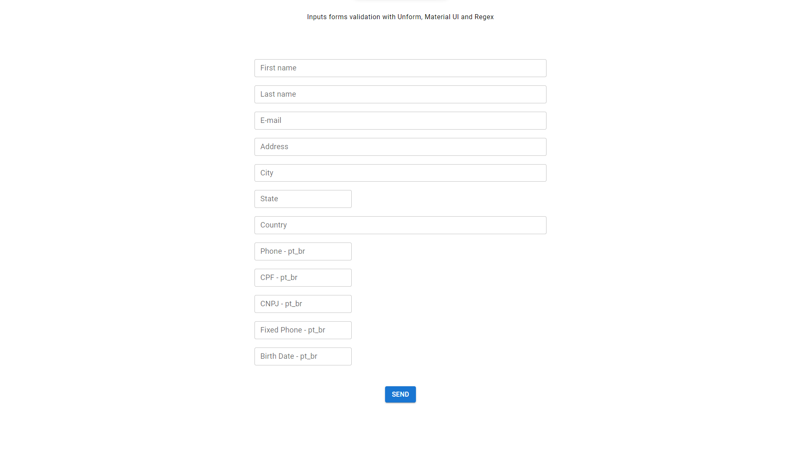

<h1 align='center'>Inputs validated with Yup </h1>

 

Validations with masks for inputs forms using [Yup](https://www.npmjs.com/package/yup), [Unform](https://unform-rocketseat.vercel.app/) and [Material UI](https://mui.com/material-ui/getting-started/installation/)

# ⚓ Description

This repository contain validations for using in your project or site.
Here, i'm using inputs of Material UI, that are imported as **TextFields**.  
Too using **Yup** lib for validation of values inside input.
For send the data for server, i'm using the **Unform** lib.

# ✅As Using

→ For create a custom input, click here: [Inputs custom with **TextField**](https://github.com/EuMarcel0/form-unform-yup/tree/main/src/shared/components/Form-Inputs)

→ After, create a component that receive yours inputs custom: [**Click here**](https://github.com/EuMarcel0/form-unform-yup/blob/main/src/shared/components/Inputs/InputsValidation.tsx).

→ For define masks on inputs, i'm create a component Masks.ts. In him, exist only defaults validation. If you want modify, enough add your validation mask: [**Click here**](https://github.com/EuMarcel0/form-unform-yup/blob/main/src/shared/Utils/Masks.ts).

→ Use too the setLocale for translate your errors messages: [Click here](https://github.com/EuMarcel0/form-unform-yup/blob/main/src/shared/components/Form-Inputs/TranslateErrors.ts).
**Remember of import the setLocale on App.tsx Ex: import './shared/components/Form-Inputs/TranslateErrors';**
